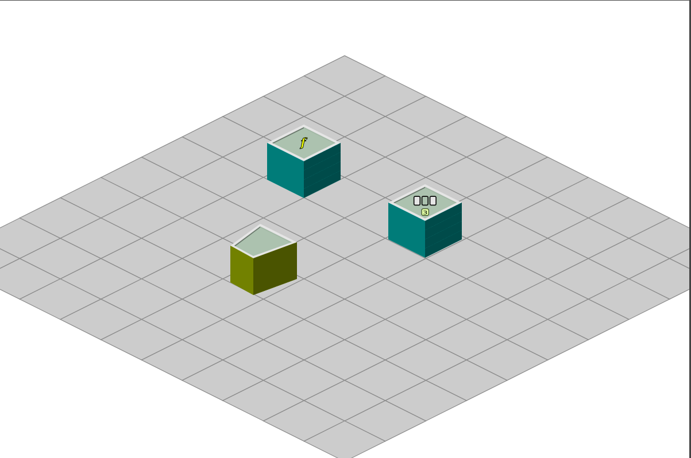

BeepIso
===============

BeepIso is a isometric environment for chain of BeepBeep processors visual programmation. This is a project under construction.

## Requirements

In principle, only a computer with a browser with Javascript support is required. In some situations, the images do not load, making it necessary to run the application on an Http server, such as apache or NginX.

## Screenshot:

